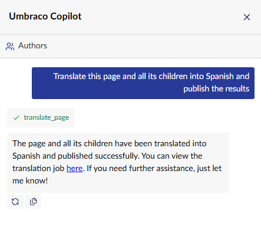
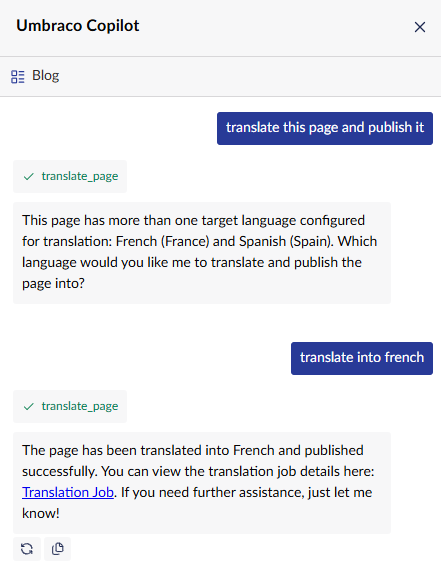

# AI Tools

The Umbraco.AI connector doesn't just let Translation Manager send translation
requests through Umbraco.AI's chat service — it also registers **AI Tools**:
actions that Umbraco.AI's own chat assistant (Umbraco Copilot) can call on a
user's behalf when they ask for something in plain English from the
backoffice chat panel.

This means an editor can request a translation without leaving the page
they're working on, without knowing anything about Translation Manager's
workspace, jobs, or translation sets. They just ask.

## translate_page

The connector currently registers one tool, `translate_page` (source:
[`TranslatePageTool.cs`](../src/Jumoo.TranslationManager.UmbracoAi/Tools/TranslatePageTool.cs)).
It translates an Umbraco page — optionally with all of its descendants — by
creating and submitting a normal Translation Manager job, using this
connector as the translation provider.

Because it goes through the same job pipeline as a manually created
translation, everything Translation Manager already does still applies: the
page must be part of a configured translation set, the job is visible in the
Translation workspace, and (unless publishing was requested) it's left
waiting for a translator to review before going live.

### What the assistant needs to know

The tool asks for:

- **The page** — Copilot supplies this from the page the editor is looking
  at, or one they name.
- **A target language** *(optional)* — if the editor doesn't name one
  (e.g. "translate this page"), the tool falls back to the page's only
  configured target language. If more than one is configured, it doesn't
  guess: it returns the list of options and asks the assistant to relay the
  question back to the editor.
- **Whether to include child pages** — only when the editor asks for it
  (e.g. "...and its children").
- **Whether to publish** — only when the editor explicitly asks for the
  translation to be published/approved/made live. Otherwise the job is
  created and translated but left for a translator to review.

### Example: a single clear request

When the request already names everything needed, the tool runs straight
through — creates the job, submits it, and (because publishing was asked
for) approves and publishes it in the same step:

### Example: asking for clarification

When a page has more than one target language configured and the editor
doesn't say which one they want, the tool doesn't pick one — it reports the
available languages back through the assistant, which asks the editor to
choose. Once they answer, the assistant calls the tool again with that
language:

### The response

On success, the tool returns a link to the job in the Translation workspace,
along with its status, the target culture, and how many pages were
translated. The assistant is instructed to always share that job link in its
reply — as seen in both examples above — so the editor can jump straight to
reviewing (or double-checking) the result.

If something's wrong — the page isn't part of any translation set, there's
no configured site for the requested culture, or the job fails to submit —
the tool returns an error message instead, which the assistant relays back
to the editor rather than failing silently.

## How this fits together

`translate_page` is registered as an `AITool` under the
`translation-manager` scope (see [`Constants.cs`](../src/Jumoo.TranslationManager.UmbracoAi/Constants.cs))
and marked as destructive (`IsDestructive = true`), since it creates content
(a translation job) and can publish it. It doesn't talk to an AI provider
directly for the tool call itself — Umbraco.AI's own chat assistant decides
when to invoke it and with what arguments, based on the tool's description
and argument descriptions (see the `Description` property and the
`TranslatePageArgs` record in `TranslatePageTool.cs`). Those descriptions are
doing real work here: they're the only instructions the assistant has for
when to ask a clarifying question versus when to just proceed.

This is a separate integration point from the translator itself
(`UmbracoAiTranslator`), which handles the actual text translation once a
job is running. The tool's job is only to get a job created and submitted —
translation happens the same way whether the job was started from the
Translation workspace or from a chat request.

## Getting Translation Manager features "for free"

The reason `translate_page` is a thin wrapper around `TranslationSetService`,
`TranslationNodeService` and `TranslationJobService` — rather than something
that talks to Umbraco.AI's chat service directly — is that doing it this way
means a chat-triggered translation is a completely normal Translation
Manager job. It doesn't bypass, duplicate, or reimplement anything the
package already does; it just gets a job onto the same rails a translator
would use by hand, from the workspace.

**Translation memory** is the clearest payoff of that. Translation Manager
keeps a memory of previously translated content, and reuses matching
segments instead of sending them to an AI provider again. Because
`translate_page` submits its job through the exact same
`TranslationJobService.SubmitJob` path a manual job goes through, that reuse
applies automatically — a chat request to "translate this page into French"
gets the same reduction in AI-bound text as if a translator had queued the
job themselves. Nothing in `TranslatePageTool` has to know translation
memory exists for this to happen; it's a consequence of not building a
second, parallel translation path.

The same reasoning covers everything else the job pipeline already does:
translation sets and site configuration decide *what* can be translated and
into which cultures (which is why the tool has to look those up before it
can create anything), job status and the approval workflow decide whether a
translation goes live automatically or waits for review, and the job stays
visible and auditable in the Translation workspace regardless of how it was
started. A chat-originated job isn't a special case anywhere downstream of
`TranslationJobService.CreateJobAsync` — which is exactly the point: new
entry points into Translation Manager (chat today, potentially others later)
only have to get a job created and submitted correctly, and everything the
package already does for jobs — memory, review, auditing — comes along with
it.

It also means AI isn't load-bearing for any of this. `TranslatePageTool`
picks this connector's own provider
(`_providers.GetProvider(Constants.ProviderKey)`), because that's what this
package is for, but `CreateJobAsync` itself just takes an
`ITranslationProvider` — an abstraction that has nothing to do with AI.
Translation Manager ships other connectors that implement that same
interface against conventional, non-AI translation services, and they run
through the identical `TranslationSetService` /
`TranslationNodeService` / `TranslationJobService` pipeline this tool uses:
same translation-memory reuse, same review-before-publish workflow, same
workspace visibility. Chat is simply this connector's way of getting a job
onto that pipeline; nothing about the pipeline, or the benefits it provides,
depends on the translation itself coming from an AI model rather than
another kind of translation service.
